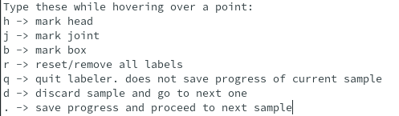
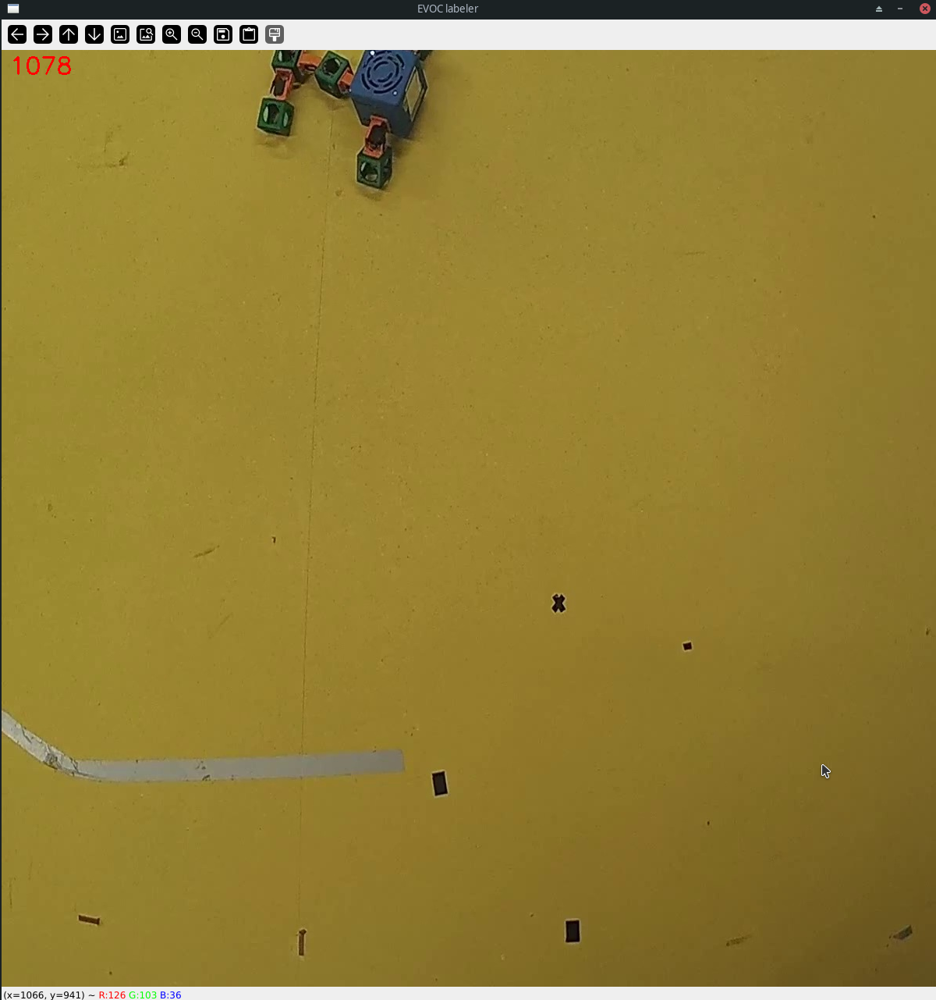

# Label and Processing
This folder contains scripts that generate image datasets from videos and provide
a robust labeling tool to those images.

If you need to check how to use a script, at any time do `to_dataset.py --help` or
`label.py --help`. 

Ensure you are in the environment constructed by `enter.sh`

## Basic Workflow
Given a folder of robot videos `videos/`, perform the following:

```
python3 to_dataset.py videos/ --outdir dataset/
python3 label.py dataset/
```

Specifying `outdir` is optional. The default is dataset but for clarity is was
added.

## Scripts
`to_dataset.py` is a video processor that creates a standardized image set 
chronologically ordered by a frame id across N videos.

`label.py` is a labeling GUI that has you place dots on the robots body and
generates two outgoing folders: The `marked-dataset` for users to double check their labeling and `labeled-dataset` that contains JSON's to be fed into Yihongs
DREAM code to train the detection model.

## How to Label
When starting `label.py`, it will open a second window containing a cheatsheet
of each command available to you.

This is that cheatsheet:



## Discard Rules
In the event you recieve an image such that the robot is only partially 
visible, you may press `d` to discard this one and get a new image to label. We
want to label images only where all limbs of the robot are visible or inferrable. If the position to you is not inferrable, you may skip it.

Example:



## Help
`to_dataset.py`:
```
usage: to_dataset.py [-h] [--skip SKIP] [--outdir OUTDIR] [--ext EXT] indir

positional arguments:
  indir            Folder containing *.[mp4|mov] files

options:
  -h, --help       show this help message and exit
  --skip SKIP      take only every N frame into the dataset
  --outdir OUTDIR  Specify the output directory of the dataset
  --ext EXT        The file extension of the images saved
```

`label.py`:
```
usage: label.py [-h] [--contribute-mode] [--ordered] [--outdir OUTDIR] [--markdir MARKDIR] [--ext EXT] indir

positional arguments:
  indir              Folder containing a set of images counting up in number

options:
  -h, --help         show this help message and exit
  --contribute-mode  Contribute mode protects the current dataset stored in `markdir` and outdir. It allows for you to pick up where you left off from.
  --ordered          By default, the sequence of images is randomized during labeling
  --outdir OUTDIR    The output directory of the labeled dataset
  --markdir MARKDIR  Contains the images with the labels burned into them
  --ext EXT          If the dataset contains different extensions, please change it here or else the output will be [filename].[ext].json instead of [filename].json
```